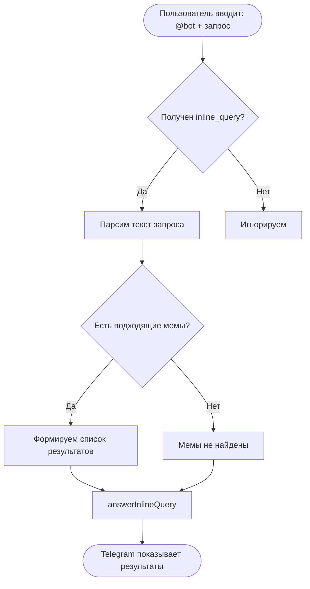
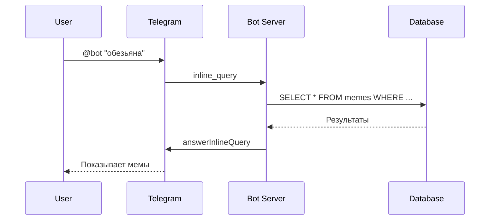
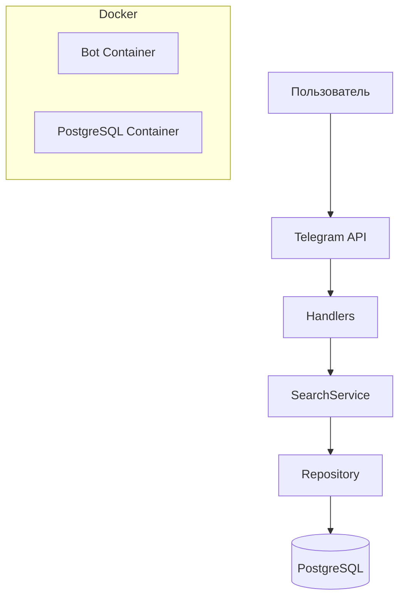
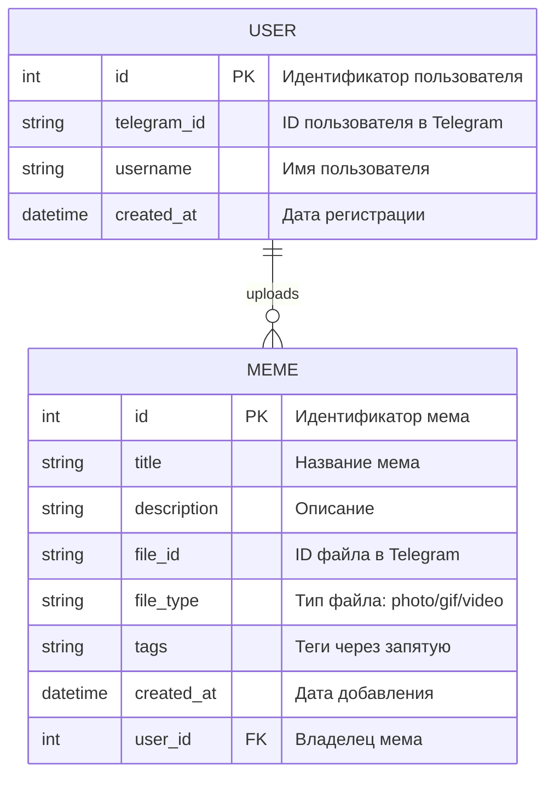

# MemeVault Project

---

## 1. Описание проекта
---
### 1.1 Что видит пользователь

Пользователь может ввести в любом Telegram-чате:

@название_бота + ключевые слова

Например:

@meme_finder_bot мне мама в детстве выколола глазки

Бот покажет подборку картинок/гифок/видео из своей базы, которые совпадают по тегам и описанию. Пользователь получит inline-выдачу прямо в чате: миниатюры, подписи и возможность отправить мем.

**Пользователь видит:**

* Inline-поиск мемов по ключевым словам
* Просмотр результатов прямо в чате
* Отправка найденных мемов одним кликом

#### Команды бота

| Команда           | Функционал                                                                |
| ----------------- | ------------------------------------------------------------------------- |
| /start            | Приветствие и краткая справка                                             |
| /help             | Выводит документацию всех команд                                          |
| /add_meme         | Позволяет пользователю загрузить свой мем (фото/гиф/видео) и указать теги |
| /list_my_memes    | Показывает мемы, которые загрузил пользователь                            |
| /delete_meme <id> | Удаляет один из своих мемов                                               |

### 1.2 Задачи, которые необходимо выполнить

1. **Создать Telegram inline-бота на aiogram**
   * инициализация бота
   * обработка inline_query

2. **Реализовать HTTP‑взаимодействие с Telegram API**
   * получение запросов от Telegram
   * отправка inline‑ответов

3. **Настроить базу данных PostgreSQL**
   * создать таблицу мемов
   * подключить SQLAlchemy (async)
   * скрыть секреты в .env

4. **Добавить ORM‑модель и репозиторий мемов**
   * модели SQLAlchemy
   * асинхронный поиск по ключевым словам

5. **Разработать сервис поиска мемов**
   * интерпретация текста запроса
   * запросы в репозиторий

6. **Реализовать обработчик inline‑запросов**
   * поиск картинок по словам пользователя
   * формирование JSON‑ответа

7. **Покрыть проект тестами (pytest + pytest-asyncio)**
   * тестирование поиска
   * тестирование репозитория
   * тестирование хендлера

8. **Добавить функциональность загрузки мемов пользователями**
   * создать команду /add_meme
   * реализовать загрузку фото / гиф / видео
   * добавить сохранение файла и тегов в БД

9. **Настроить Docker и деплой**
   * создать Dockerfile
   * настроить docker-compose
   * выложить образ в Docker Hub

---

### 1.3 Оценка времени по задачам

| Задача                                         | Время     |
| ---------------------------------------------- | --------- |
| Разобраться с aiogram inline mode              | 6 часов |
| Минимальная настройка проекта                  | 2 часа    |
| Реализация HTTP-взаимодействия через aiogram | 3 часа    |
| Настройка PostgreSQL + SQLAlchemy async        | 8 часов |
| Создание моделей и репозиториев                | 5 часов |
| Реализация SearchService                       | 3 часа    |
| Inline‑обработчик                              | 3 часа    |
| Написание тестов                               | 8 часов |
| Docker-конфигурация и деплой                   | 4 часа    |
| Подготовка документации                        | 4 часа    |

**Общее время: ~46 часов**

---

### 1.4 Распределение ролей в команде

Васильева Алина все делает одна 😭

---

## 2. Схемы
---
### Блок-схема работы бота

---

### Последовательность обработки запросов

### Архитектурная схема

### ER-модель БД

